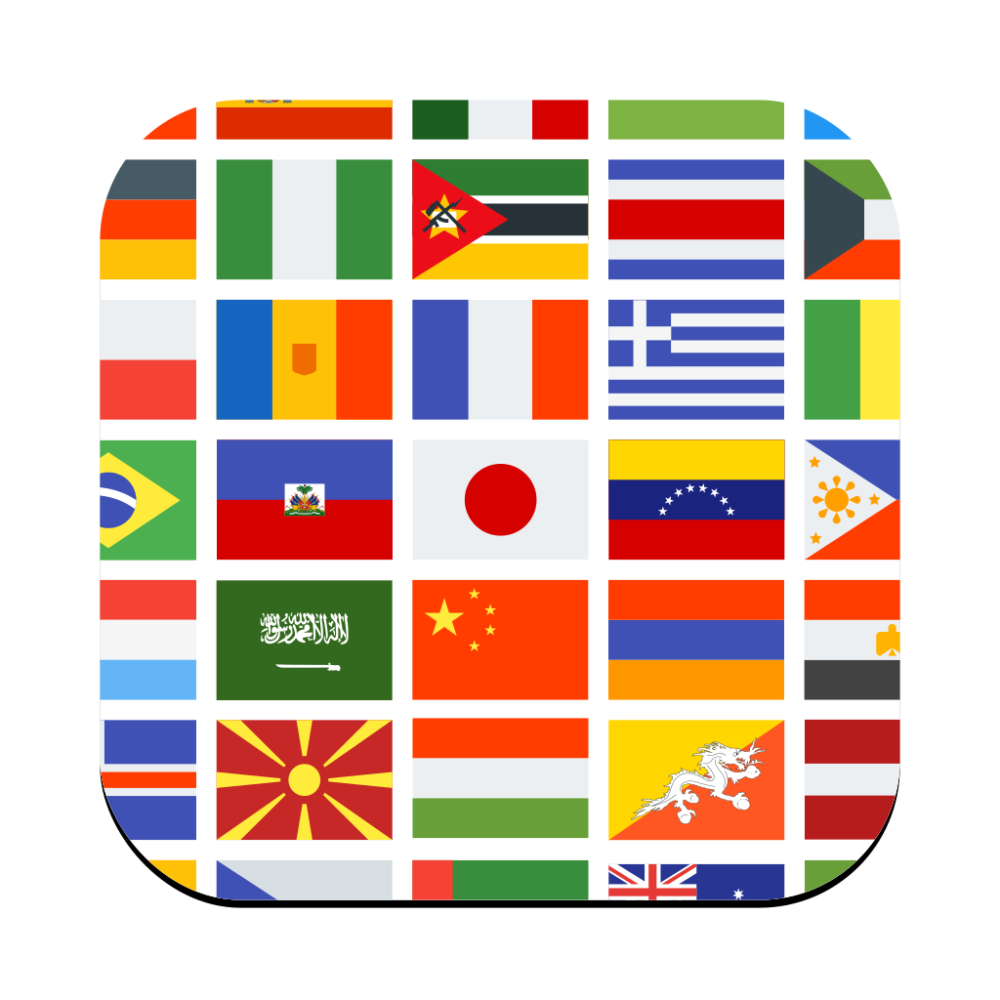
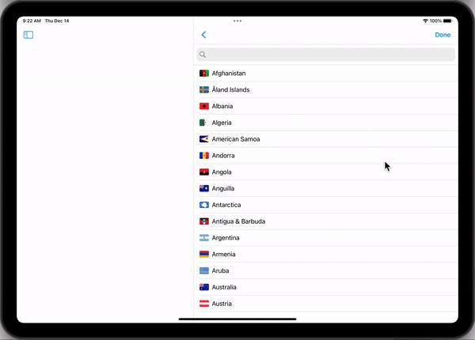
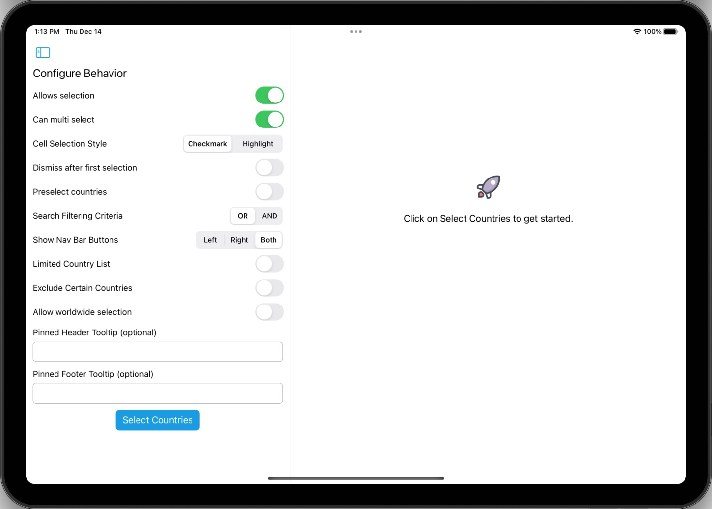

<p align="center">
  
</p>

<p align="center">
    
    
    
</p>

# CountryKit 

CountryKit provides a convenient way to interact with countries, their metadata and comes with a pre-built UI.
<p align="center">
  
</p>

## Installation (iOS, macCatalyst)

### Swift Package Manager 
Add CountryKit to your project via Swift Package Manager.

`https://github.com/eclypse-tms/CountryKit`

## PickerView Usage
```
//in a view controller
import CountryKit
...
let countryPickerVC = CountryPicker()
countryPickerVC.delegate = self //to receive callbacks when a country is selected

//present the view controller according to your UX
let navController = UINavigationController(rootViewController: countryPickerVC)
navController.modalPresentationStyle = .formSheet
present(navController, animated: true)
```

## CountryList Usage (No UI)
```
import CountryKit
...
//instantiate the provider object or preferably inject it 
let provider: CountryProvider = CountryProviderImpl()
...

//optional but recommended. call this only-once preferably in
//a non-main queue. 
provider.loadAdditionalMetaData()
...

//obtain a country by that country's alpha2 code
let countryElSalvador = provider.find(alpha2Code: "SV")
print(countryElSalvador)
```

## Country object

There are 250 countries or regions present in the CountryKit. Country data model in CountryKit contains the following information:
|property|description|
|-|-|
|alpha2 code|ISO 3166-1 alpha-2 country code [wiki link](https://en.wikipedia.org/wiki/ISO_3166-1_alpha-2)|
|alpha3 code|ISO 3166-1 alpha-3 country code [wiki link](https://en.wikipedia.org/wiki/ISO_3166-1_alpha-3)|
|localized name|automatic localization of the country names based on user's preferences|
|address labels|address labels used in each country. for example in Chile the address fields are composed of street, city and postal code only|
|associated locales|all known [Locales](https://developer.apple.com/documentation/foundation/locale) for this country.|
|ccTLD|A country code top-level domain. for example: .de for Germany|
|capital city|Capital city of each country in English|
|official languages|for example: Canada's' official languages are fr and en (French and English)|
|area|geograhical size of the country or territory in km2 or mi2|
|timezones|all the timezones that a country spans|
|calling code|international dialing codes. for example: India's dialing code is +91|
|Commonwealth membership|For example: Belize is a Commonwealth member|
|Sovereignity status|Whether another state claims this territory or not|


## UI Customization

CountryKit's prebuilt UI is highly customizable. In order to customize the behavior, you create an instance of [CountryPickerConfiguration](./Sources/CountryKit/ui/CountryPickerConfiguration.swift) object and pass it to the picker view before presenting:

```
import CountryKit
...
var config = CountryPickerConfiguration.default()
//customize it according to your needs
config.canMultiSelect = false

let countryPickerVC = CountryPicker()
countryPickerVC.pickerConfiguration = config
```

### Full list of all customizable options
```
/// controls whether the country selection interface allows user to select a country.
public var allowsSelection: Bool = true

/// controls whether the country selection interface allows user to select multiple countries.
public var canMultiSelect: Bool = true

/// restrict the countries to the ones in this list. leave empty to show all the countries.
public var countryRoster: Set<Country> = Set()

/// if the countries are restricted to a limited set, you may
/// provide justification to the user as to why that is the case. optional.
public var rosterJustification: String = ""

/// list of countries that should be excluded from the main list.
/// if countryRoster is provided, this property is ignored.
public var excludedCountries: Set<Country> = Set()

/// if some countries are removed the list, you may provide justification
/// to the user as to why that is the case. optional.
public var excludedCountriesJustification: String = ""

/// after the user makes the first selection, automatically dismisses
/// the interface. defaults to false.
public var dismissAfterFirstSelection: Bool = false

/// the countries on this list are preselected when the UI first opens
public var preselectedCountries: Set<Country> = Set()

/// allow user to select worldwide as an addition option.
/// worldwide represents a selection of all countries and regions.
public var shouldShowWorldWide: Bool = false

/// only needed if your are planning to display worldwide as a selectable option.
/// for example, in english this property would read "Worlwide".
public var localizedWorldWide: String = ""

/// only needed if your are planning to display worldwide as a selectable option.
/// for example, in english this property would read something like 
/// "Selecting Worldwide clears previous country selections and represents a
/// selection of all countries and regions."
public var localizedWorldWideDescription: String = ""

/// provide custom bar button that appears on the left (leading) side of the 
/// navigation bar instead of chevron.backward styled back bar button.
/// if you provide a custom button, you are responsible for dismissing the picker view yourself.
/// if this button is provided, buttonDisplayOption is ignored
public var leftBarButton: UIBarButtonItem?

/// provide custom bar button item that appears on the right (trailing) side of the
/// navigation bar instead of system Done button.
/// if you provide a custom button, you are responsible for dismissing the picker view yourself.
/// if this button is provided, buttonDisplayOption is ignored
public var rightBarButton: UIBarButtonItem?

/// when provided, a header text is displayed that is pinned to the top 
/// of the picker view and does not scroll away.
public var pinnedHeaderText: String?

/// when provided, a footer text is displayed that is pinned to the bottom 
/// of the picker view and does not scroll away.
public var pinnedFooterText: String?

/// the methodology to use when filtering countries
public var searchMethodology: SearchMethodology = .orSearch

/// controls whether to display both the cancel and done buttons in the UI
public var buttonDisplayOption: ToolbarButtonsDisplayOption = .displayBothButtons

/// controls which countries, regions or territories to display in the PickerUI. 
/// By default, it includes all territories that have an alpha 2 code assigned to it.
/// If a country roster is provided, this property is ignored.
public var countryListOption: CountryListOption = .all

/// you can provide your own custom sorting algorithm for the picker view.
public var countrySorter: CountrySorter?

/// if you are presenting the picker view in a window that already includes a search bar,
/// turn this flag to false to hide the embedded search bar.
public var showSearchBar: Bool = true

/// additional configuration parameters when running the picker view in mac catalyst mode
public var macConfiguration: MacConfiguration = .default()

/// theme to apply to the picker view
public var theme: CountryPickerTheme = .default()
```

## Extending CountryKit
Do you want to see additional metadata about each country? Extending CountryKit is fairly simple. Provide a csv file keyed by each country's alpha2Code. Checkout [Locales.csv](./Sources/CountryKit/country_list/Locales.csv) as an example. Submit a ticket or pull request to get started.

## Example
CountryKit provides a demo app for you to play with the behavior. See [/Example/Countries.xcodeproj](./Example/Countries.xcodeproj). It is highly recommended to run the demo app in a **iPad** or **mac** device. The example app already includes some of the configuration behavior in the UI for easy testing.
<p align="center">
  
</p>

## Corrections and Feature Requests
Submit a ticket or pull request to get started. All contributions are welcome.
